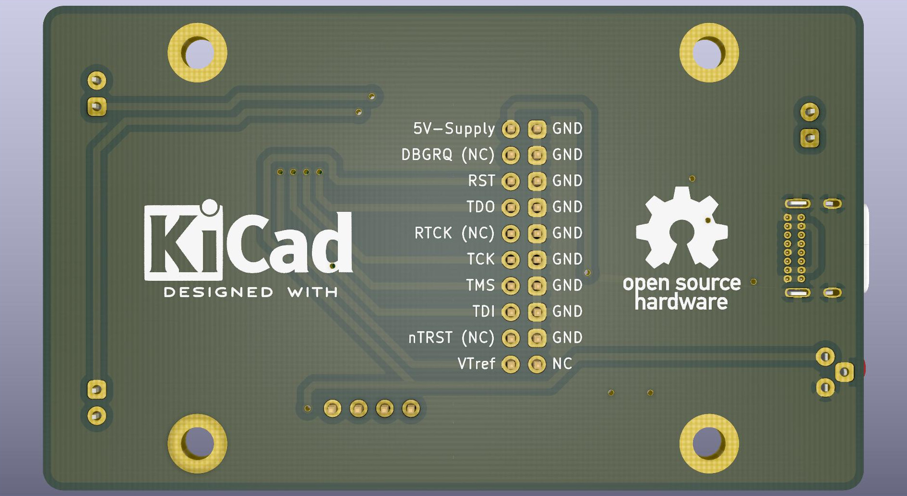

# Zigbeebox

Powerful zigbee coordinator with USB and debug port in metal enclosure.

## Description

## Features
* Use mostly THT and superior SMD components to allow soldering by hand with average tools
* PCB dimensions are designed to fit in a cheap metal enclosure
* Avoid dongle-style layout to assist final placement away from any interference

## Technical details

## PCB BOM
The following components are needed to assemble the coordinator.

| Component  | Type | Package | Value | Quantity |
| ---------- | ---- | ------- | ----- | -------- |
| F1 | Polyfuse | SMD-1206 | Ih=~250mA It=~500mA | 1 |
| R1-R2 | Resistor | SMD-1206 | 33Ω | 2 |
| R3 | Resistor | SMD-1206 | 1.5kΩ | 1 | 
| R4-R6 | Resistor | SMD-1206 | 100Ω | 3 |
| R7 | Resistor | SMD-1206 | 1kΩ | 1 |
| R8-R9 | Resistor | SMD-1206 | 5.1kΩ | 2 |
| C1-C2 | Tantalum capacitor | SMD-1206 | 10uF | 2 |
| C3 | Capacitor | SMD-1206 | 100nF | 1 |
| C4-C5 | Capacitor | SMD-1206 | 47pF | 2 |
| PWR-JOIN-ACT | LED | 3mm THT | Vf=~2.2V, If=~10mA | 3 |
| LD1117 | Voltage regulator | SOT223 | LD1117S33TR | 1 |
| USB-C | Receptacle | 16-pin THT | GCT USB4085 | 1 |
| RESET | Tactile switch | 3-pin THT 4.5x4.5mm | TS-C017 | 1 |
| JLINK-JTAG | Connector | 2.54mm IDC double row | 20pin keyed male | 1 |
| Pin header | Connector | 2.54mm single row | 4-pin male | 1 |

## Flashing

## Assembly and application
1. Clone or download this repository.
2. Use the prebuilt [gerber archive](kicad_board/gerber/zigbeebox.zip) to print the custom pcb. Any chinese manufacturer (JLPCB, ALLPCB, PCBWAY, etc.) can fabricate a copy for a couple dollars. Really, it's dirt cheap.
3. Once you got the pcb and the listed components, assemble the coordinator by hand soldering, no special tool needed.
4. Flash the desired firmware with one of the available methods.
