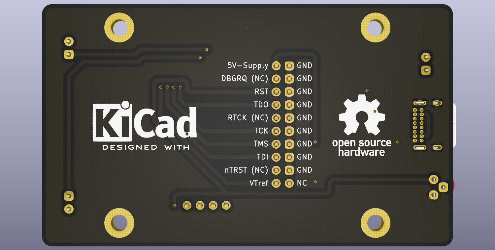
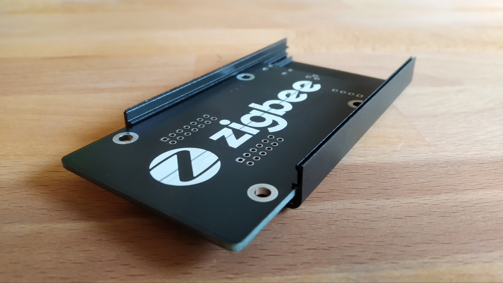

# zigbeebox

Powerful zigbee coordinator with USB and debug port in metal enclosure.

## Description

[Zigbee in general.](https://en.wikipedia.org/wiki/Zigbee)

The coordinator is the central unit of the zigbee network, handling significant RF traffic in most cases. This project offers low-cost open-source hardware for this task, as a remix of many DIY coordinators out there. Takes a bit of time and basic soldering skills to assemble, but it can replace any manufacturers proprietary device when ready. Using the right firmware and server application, you can build a reliable, secure zigbee network without factory restrictions, involving almost any zigbee appliance. This opens the possibility to use IKEA Tradfri lights along with Xiaomi sensors, Philips Hue products, and many more in the same network. The pcb utilizes a cheap chinese CC2538+CC2592 RF module with ARM Cortex-M3 based SoC, and enough memory to serve a lot of connections with good performance.

The design heavily relies on open-source code, such as [Zigbee2MQTT](https://www.zigbee2mqtt.io) and various firmware.

## Features
* Zigbee 3.0 capable SoC with external antenna connector and RF amplifier frontend
* Use mostly THT and superior SMD components to allow soldering by hand with average tools
* PCB dimensions are designed to fit in a cheap metal enclosure for better shielding
* Avoid dongle-style layout to assist final placement away from any interference
* Mounted with convenient USB Type-C receptacle, detach & orientation sensing
* Plug & play firmware flashing on the J-Link compatible 20pin IDC header
* Indicator LEDs for power, allow join mode, ZNP activity (RF traffic)
* Self-regenerating polyfuse protection for USB host & device

*Since the pcb applies a considerable amount of copper under the CC2538+CC2592 module, it is highly recommended to use the IPEX connector and connect an external antenna, even without metal enclosure.*

## PCB BOM
The following components are needed to assemble the coordinator.

| Component  | Type | Package | Value | Quantity |
| ---------- | ---- | ------- | ----- | -------- |
| F1 | Polyfuse | SMD-1206 | Ih=250mA, It=500mA | 1 |
| R1-R2 | Resistor | SMD-1206 | 33Ω | 2 |
| R3 | Resistor | SMD-1206 | 1.5kΩ | 1 |
| R4-R6 | Resistor | SMD-1206 | 100Ω | 3 |
| R7 | Resistor | SMD-1206 | 1kΩ | 1 |
| R8-R9 | Resistor | SMD-1206 | 5.1kΩ | 2 |
| C1-C2 | Tantalum capacitor | SMD-1206 | 10uF | 2 |
| C3 | Capacitor | SMD-1206 | 100nF | 1 |
| C4-C5 | Capacitor | SMD-1206 | 47pF | 2 |
| PWR-JOIN-ACT | LED | 3mm THT | Vf=2.2V, If=10mA | 3 |
| LD1117 | Voltage regulator | SOT223 | LD1117S33TR | 1 |
| USB-C | Receptacle | 16-pin THT | GCT USB4085 | 1 |
| RESET | Tactile switch | 3-pin THT 4.5x4.5mm | TS-C017 | 1 |
| JLINK-JTAG | Connector | 2.54mm IDC double row | 20-pin keyed male | 1 |
| Pin header | Connector | 2.54mm single row | 4-pin male | 1 |

Additional parts:

| Component  | Type | Package | Quantity | Source |
| ---------- | ---- | ------- | -------- | ------ |
| *[CC2538+CC2592 Module](https://github.com/uzsito/CC2538-CC2592-kicad-component)* | *Zigbee RF board* | *33-pin 20.5x33mmm* | *1* | Aliexpress, Ebay |

## Flashing
You can download and burn compiled firmware from the following repositories:

| Repository  | Firmware | Tested |
| --------- | --------- | ------ |
| [reverieline/CC2538-CC2592-ZNP](https://github.com/reverieline/CC2538-CC2592-ZNP) | MODKAMRU_V3_USB.hex | Tested |
| [antst/CC2538-ZNP-Coordinator-firmware](https://github.com/antst/CC2538-ZNP-Coordinator-firmware) | | Not tested |
| [Koenkk/Z-Stack-firmware](https://github.com/Koenkk/Z-Stack-firmware) | | Not tested |

Flashing methods:
* Using [J-link and J-Flash application](https://github.com/uzsito/zigbeebox/wiki/Flashing-with-JLink), connecting to 20-pin header with ribbon cable (Tested)
* Using [Raspberry Pi and OpenOCD](https://gist.github.com/hwhw/fc43892785aa84913d03495c97b0f25a) connecting with dupont wires (Not tested)

## Enclosure

It is optional to put the board in a cheap metal case to achieve better shielding and appearance. The finished pcb fits perfectly in the following box by design:
* 80x50x20mm modular aluminium enclosure (2-3 USD from Aliexpress or Ebay)

*Finished photos and cutout templates coming soon.*

Former prototype:

## Assembly and application
1. Clone or download this repository.
2. Use the prebuilt [gerber archive](kicad_board/gerber/zigbeebox.zip) to print the pcb. Any chinese manufacturer (JLPCB, ALLPCB, PCBWAY, etc.) can fabricate a copy for a couple dollars. Really, it's dirt cheap.
3. Once you got the pcb and the listed components, assemble the coordinator by hand soldering, no special tool needed.
4. Flash the desired firmware with one of the available methods.
5. Connect the board to a machine running zigbee2mqtt or other zigbee server application, and check the log for your new coordinator.
