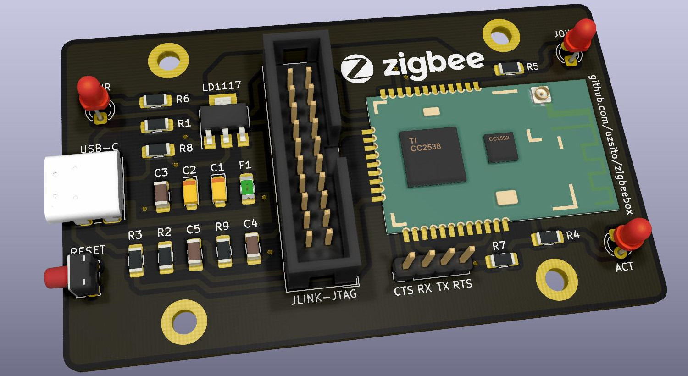

# Zigbeebox

Powerful zigbee coordinator with USB and debug port in metal enclosure.

### Upload in progress!

## Objectives
* Use mostly THT and superior SMD components to allow soldering by hand with average tools
* PCB dimensions are designed to fit in a cheap metal enclosure
* Avoid dongle-style layout to assist final placement away from any interference

## Teaser:

